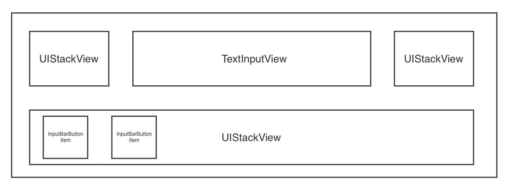

# MessageInputBar

The `MessageInputBar` is the reactive `InputAccessoryView` of the `MessagesViewController`. It has a fairly basic delegate, `MessageInputBarDelegate`, that can be used to detect when the send button is pressed however its individual `InputBarButtonItem`'s can be individually set up to react to various events.

## Basic Setup

We recommend viewing the example project for demos on how to make the `MessageInputBar` look like Facebook Messenger's, Slack's or iMessage.

## FAQ

```swift
Q: HELP! All kinds of `UILayoutConstraint`'s are being broken?
// A: Be sure that you are not animating any of the sizing during `viewDidLoad()`. For anything else, try https://www.wtfautolayout.com first

Q: I set the items to the left stack view but I cannot see them?
// A: Remeber to call `func setLeftStackViewWidthConstant(to newValue: CGFloat, animated: Bool)`. A width constraint is required so that the `InputTextView` always spans the width between the left and right stack views

Q: How do I add padding?
// A: There are two `UIEdgeInsets` that manage the padding. There is `padding` and 'textViewPadding`. Note that `textViewPadding.top` does nothing, as if you want to add padding between the top of the `InputTextView` and its superview you would use `padding`/ 

```

## Delegate

```swift
func messageInputBar(_ inputBar: MessageInputBar, didPressSendButtonWith text: String)
    
func messageInputBar(_ inputBar: MessageInputBar, didChangeIntrinsicContentTo size: CGSize)
    
func messageInputBar(_ inputBar: MessageInputBar, textViewTextDidChangeTo text: String)
``` 

## Layout

The layout of the `MessageInputBar` is made of of 3 `UIStackView`'s and an `InputTextView` (subclass of `UITextView`). The padding of the subviews can be easily adjusted by changing the `padding` and `textViewPadding` properties. The constraints will automatically be updated.



```swift
H:|-(padding.left)-[UIStackView(leftStackViewWidthContant)]-(textViewPadding.left)-[InputTextView]-(textViewPadding.right)-[UIStackView(rightStackViewWidthContant)]-(padding.right)-|

V:|-(padding.top)-[InputTextView]-(textViewPadding.bottom)-[UIStackView]-(padding.bottom)-|
```

It is important to note that each of the `UIStackView`'s to the left and right of the `InputTextView` are anchored by a width constraint. This way the `InputTextView` will always fill the space inbetween in addition to providing methods that can easily be called to hide all buttons to the right or left of the `InputTextView` by setting the width constraint constant to 0.

```swift
func setLeftStackViewWidthConstant(to newValue: CGFloat, animated: Bool)
func setRightStackViewWidthConstant(to newValue: CGFloat, animated: Bool)
```

## InputBarButtonItem

It is recommended that you use the `InputBarButtonItem` for the `UIStackView`'s. This is because all `UIStackView`'s are intitially set with the following properties:

```swift
let view = UIStackView()
view.axis = .horizontal
view.distribution = .fill
view.alignment = .fill
view.spacing = 15
```

This will layout the arrangedViews based on their intrinsicContentSize and if there is extra space the views will be expanded based on their content hugging `UILayoutPriority`.

### Size

Each `InputBarButtonItem`'s `intrinsicContentSize` can be overridden by setting the `size` property. It is optional so when set to `nil` the `super.intrinsicContentSize` will be used. 

### Spacing

Spacing can be set using the `spacing` property. This will change the content hugging `UILayoutPriority` and add extra space to the `intrinsicContentSize` when set to `.fixed(CGFloat)`.

### Hooks

Each `InputBarButtonItem` has properties that can hold actions that will be executed during various hooks such as the button being touched, the `InputTextVIew `text changing and more! Thanks to these easy hooks with a few lines of code the items can be easily resized and animated similar to that of the Facebook messenger app.

```swift
// MARK: - Hooks

public typealias InputBarButtonItemAction = ((InputBarButtonItem) -> Void)
    
private var onTouchUpInsideAction: InputBarButtonItemAction?
private var onKeyboardEditingBeginsAction: InputBarButtonItemAction?
private var onKeyboardEditingEndsAction: InputBarButtonItemAction?
private var onTextViewDidChangeAction: ((InputBarButtonItem, InputTextView) -> Void)?
private var onSelectedAction: InputBarButtonItemAction?
private var onDeselectedAction: InputBarButtonItemAction?
private var onEnabledAction: InputBarButtonItemAction?
private var onDisabledAction: InputBarButtonItemAction?
```

## Further Questions?

Contact the components author [Nathan Tannar](https://github.com/nathantannar4) on the Slack channel.

